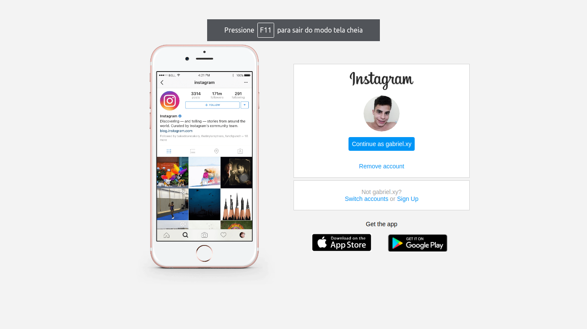
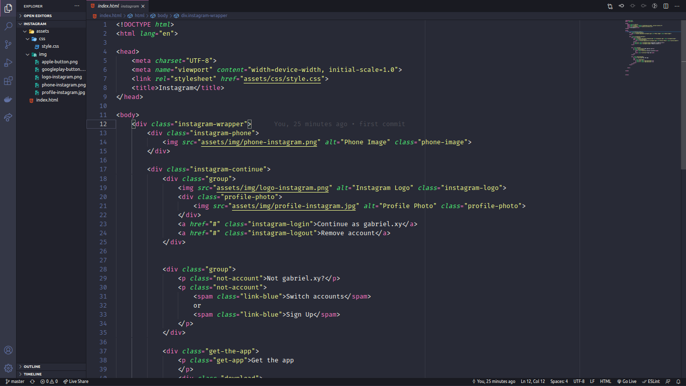

# **Página inicial do Instagram** 🚀🚀🚀

### Reprodução da página de login do Instagram, abordando o conceito de CSS Flexbox e responsividade. 

### Projeto desenvolvido para práticar "Recriando a página inicial do Instagram" da Digital Innovation One - Decola dev, mediado por Gabriela Pinheiro.  

#### 🧑‍💻 Link para a página(index): [Página inicial Instagram](https://github.com/Gabrielm3/clone-instagram/blob/master/index.html)

[Instagram - Página inicial]

[pré-visualização - index.html]

[pré-visualização - style.css]

